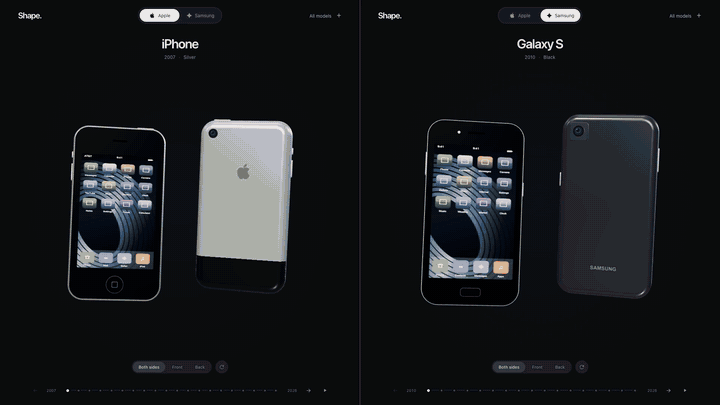

# Shape: The Phone Design Archive

A scrollable 3D journey through iPhone and Samsung Galaxy design. Phone bodies, cameras, screens and materials transform as you move through the timeline. Rotate the models, inspect both sides, and explore folding displays.

**[Explore the live archive](https://studio.aadityamore.com/shape/)** · **[More Studio experiments](https://studio.aadityamore.com/)**

[](https://studio.aadityamore.com/shape/)

The demo shows both sides of each phone. Regular sections play at twice the original speed; folding movements retain their original timing. Apple and Samsung stay synchronized throughout.

## Inspiration

I had this idea for a while and finally built it. The motion was inspired by **[Wonderful Things (Apple Event Intro Video, Sept. 2019)](https://www.youtube.com/watch?v=a4PraWW82_A)**.

## Explore

- 20 iPhone and 17 Samsung Galaxy design milestones.
- Continuous transformations between phone bodies, displays, cameras and finishes.
- Front, back and both-sides views, with drag rotation and a rotation button.
- Book-style and clamshell folding animations, including reversible transitions.
- A timeline, model picker, keyboard navigation and a guided journey.
- Responsive layouts, touch controls, reduced-motion support and an SVG fallback when WebGL is unavailable.

## Run locally

Requires Node.js 22 or newer. Production uses Node.js 24.

```sh
npm ci
npm run dev -- --host 127.0.0.1 --port 5173
```

Open <http://127.0.0.1:5173/>.

```sh
npm run build
npm run preview
```

## Controls

| Action | Control |
| --- | --- |
| Change model | Scroll, timeline, Left/Right arrow keys |
| First or last model | Home/End |
| Pick a model | All models |
| Switch collection | Apple / Samsung |
| Inspect the hardware | Swipe or drag sideways on a phone, or use the rotation button |
| Choose a view | Front / Back / Both sides |
| Move the hinge | Fold / Unfold on supported models |
| Guided tour | Play; scroll or touch to stop |

On mobile, vertical swipes still scroll through models and pinch gestures retain browser zoom. Fold controls remember each model's pose while you explore its brand. Scrolling backward retraces the transformations.

## Built with

**React + TypeScript + Motion + Three.js + Vite.**

A persistent Three.js scene morphs fixed-topology meshes instead of swapping whole scenes. Screens and wallpapers are generated locally. The viewer loads separately from the interface, limits pixel density, pauses when hidden and disposes its resources on unmount. There are no runtime asset downloads, analytics or remote APIs.

## Validation

```sh
npm run build
npm run test:catalogue
npm run test:fold-geometry
npm run test:flip-slab
npm run test:manufacturer-specs
npm run test:body-profiles
npm run test:hinge-controls
npm run test:phone-drag
```

These checks cover catalogue consistency, rendered dimensions, camera placement, folding geometry, hinge clearance, rotation framing, continuous transitions and reverse paths. The development-only `/review/transition-lab.html` provides paused transition positions for visual inspection.

## Hosting

The archive is independently deployed on Vercel from this repository's `main` branch. The Studio hub routes its public `/shape/` path to that deployment.

```sh
npm run build:vercel
```

This builds `vercel-dist/shape/`, including namespaced assets, canonical metadata and a sitemap. The upstream root redirects to Studio; the namespaced route stays accessible to Studio's rewrite. Deployment configuration is in `vercel.json`.

## Recording the demo

With the dev server running on port 5173, and FFmpeg plus Playwright's Chromium installed:

```sh
npx playwright install chromium
node scripts/record-reddit.mjs
```

The script captures matching 960 × 1080, 30 fps Apple and Samsung clips to `recordings/reddit-both-sides/`. It uses the existing scroll and pointer controls, a shared timing map, and the Both sides view. It keeps labels visible while stepping the browser clock. Join the clips with FFmpeg:

```sh
ffmpeg -i recordings/reddit-both-sides/apple-scroll-rotate.mp4 \
  -i recordings/reddit-both-sides/samsung-scroll-rotate.mp4 \
  -filter_complex '[0:v][1:v]hstack=inputs=2[v]' -map '[v]' \
  -an -c:v libx264 -crf 18 -pix_fmt yuv420p -movflags +faststart \
  recordings/reddit-both-sides/apple-vs-samsung.mp4
```

The GIF above is a smaller rendition of the final 38.2-second side-by-side recording. Generated full-resolution captures are excluded from Git.

## References and limitations

The archive represents selected design milestones, not every released SKU. Models, finishes and wallpapers are original, simplified reconstructions, not manufacturer CAD assets. Fine geometry and some visual proportions are illustrative. Catalogue entries include announced designs; see each model's references and availability notes.

- [Apple reference audit](review/apple-reference.md)
- [Samsung reference audit](review/samsung-reference.md)
- [Hinge and control review](review/hinge-controls.md)
- [Detailed implementation notes](docs/implementation.md)

This is an independent project, unaffiliated with Apple or Samsung. Product names and trademarks belong to their respective owners.

Made by [Aaditya More](https://aadityamore.com/) · [LinkedIn](https://www.linkedin.com/in/aadityavmore/) · [GitHub](https://github.com/aaditya-v-more)
